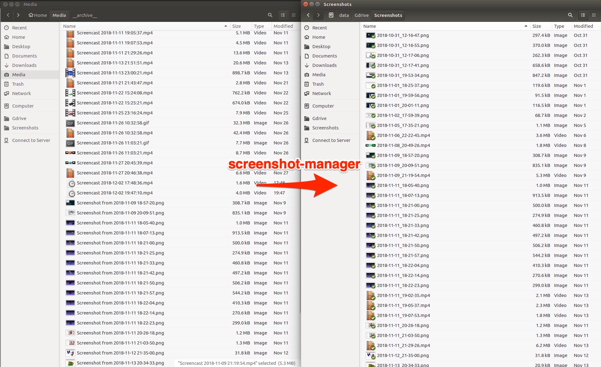

# screenshot-manager

Rename and copy screenshot/screencast into a single folder to organize screenshots for different platforms and file types.



## Why?

I usually take screenshot/screencast just for logging in daily basis. It is quite useful if we put them in a single folder or cloud service (ie. Google Drive)
to synchronize them among multiple devices and platforms. However, sometimes this is difficult because of the default saving location
of screenshot (ie. `~/Desktop` on macOS) and difference of the name
(ie. `Screenshot from %Y-%m-%d %H-%M-%S.png` on Ubuntu and `Screen Shot %Y-%m-%d at %H.%M.%S.png`, `Kapture %Y-%m-%d at %H.%M.%S.mp4` on macOS).
This software serves some solutions for this with a simple Python script and Cron job.

## How to use it?

First, you need to install the python script:

```
pip install git+https://github.com/wkentaro/screenshot-manager.git
```

Next, you run `crontab -e` to add the periodical job:

```
*/5 * * * * /usr/local/bin/screenshot-manager --to-location ~/GoogleDrive/Screenshots
```

That's it!

If you want to change some of the default behavior,
please refer to [Advanced usage](#advanced-usage).

## Advanced usage

```
# To check the behavior.
screenshot-manager --verbose

# You can configure the source location and others.
# See screenshot-manager --help for more detail.
screenshot-manager --from-location ~/Documents ~/Desktop
screenshot-manager --from-format 'Video from %Y-%m-%d %H-%M-%S'
screenshot-manager --to-format '%Y-%m-%d-%H-%M-%S'
```

## Supported formats

If it is not supported, the screenshot will be just copied without renaming.  
Please check output of `screenshot-manager --verbose` or `screenshot_manager/cli.py` to see the supported formats.


## License

See [LICENSE](LICENSE).
